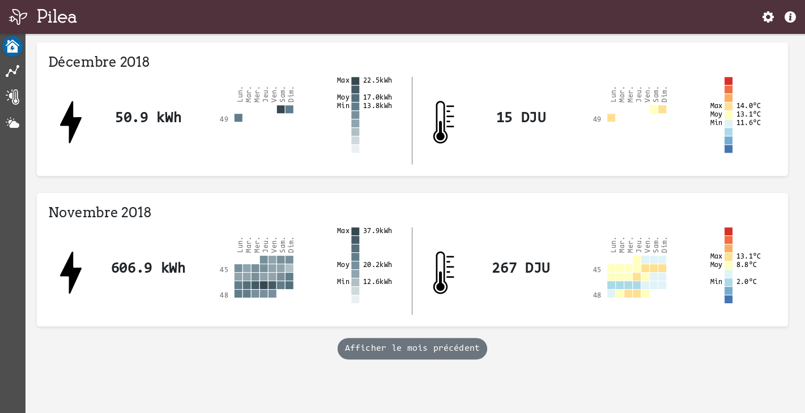
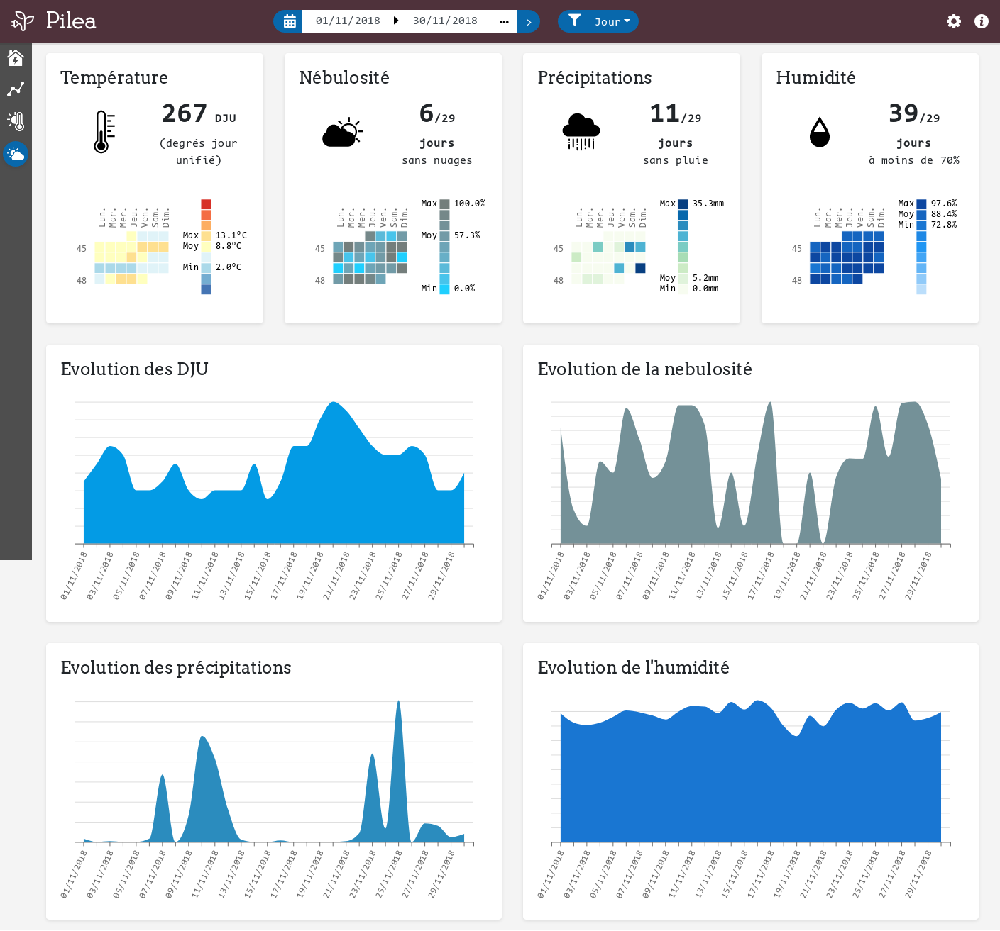

# Pilea - A little dashboard to analyse your electricity consumption data from Linky

The idea of Pilea is to display electricity consumption and weather data on a little dashboard that allow the user to:

* Better understand his electricity consumption,
* Analyse his electricity consumption throw weather data (in a first time, essentialy temperature).

## Disclaimer

**This app is not a tentative to prove that Linky is cool.**
I'm not a big fan of Linky and you can understand why on [Reporterre.net [fr]](https://reporterre.net/Linky-n-est-pas-un-ami-la-grande-enquete-de-Reporterre)

But, now we have this little sneaky guy in our home, well, let's use it.

And I can say that dispite what Enedis says: `Linky is great opportunoity for users to understand their consumption and reduce it blablabla..`

They do nothing to help individuals to use their data in their own (and not just visualize it on their website or on their partner's one).
There's no API (or maybe there's one but any documentation can't be found) to programmaticly get our own data.

I want to thanks [KibOost](https://github.com/KiboOst/) for [the retroengineering he has done](https://github.com/KiboOst/php-LinkyAPI).

## Interface

A dashboard with several tabs :

* Current consumption state
* Electricity consumption graphics
* DJU vs Electricity consumption
* Meteo (T°, Nebulosity, Rain, Humidity)

### Current consumption state

### Electricity consumption graphics

### DJU vs Electricity consumption

[DJU (Degré jour unifié or Degree day in english) [fr]](https://fr.wikipedia.org/wiki/Degr%C3%A9_jour_unifi%C3%A9) defines the gap between outdoor temperature and a reference temperature (18°C).
It's used to define rigor of a winter. Basicly, the more there are DJU during a day, the colder it gets outside.

### Meteo

## Data

Data are daily collected, we get:

* Electricity consumption data from your Linky via Enedis API (inspired by [php-LnkyAPI](https://github.com/KiboOst/php-LinkyAPI))
* Weather observation data from [Meteo France Synop data](https://donneespubliques.meteofrance.fr/?fond=produit&id_produit=90&id_rubrique=32)

## Install

First of all:

* You'll need a Linky (obviously) and a [Enedis account](https://espace-client-connexion.enedis.fr/auth/UI/Login?realm=particuliers)
* Logged in your Enedis account, you have to activate option *Courbe de charge* in order to get your hourly consumption

### Easy way - Using YunoHost

* Get a [YunoHost](https://yunohost.org/) instance
* Install Pilea with its [package](https://github.com/SimonMellerin/pilea_ynh)

### Hard way - Doing it all by hand

**Requirements:**
* PHP 7.2 or higher
* MySQL 5.5 or higher
  (PostgreSQL & SQLite should work but you'll have to adapt `.env` & `config/packages/doctrine.yaml`)

**Installation:**
* Get [the repo](https://github.com/SimonMellerin/Pilea)
* Set Database name, user and password in `.env` file
* Install [Composer](https://getcomposer.org/) dependencies: `composer install`
* Run install script: `bin/console pilea:install`
* Set up cron: `echo "*/10  *  *  *  * [user] /[app_folder]/bin/console pilea:fetch-data false" > /etc/cron.d/pilea`
  (replace *[user]* and *[app_floder]* with your config)
* Config [NGINX](https://symfony.com/doc/current/setup/web_server_configuration.html#web-server-nginx) or [Apache](https://symfony.com/doc/current/setup/web_server_configuration.html) as you would do for any Symfony 4 application

Be aware that there's no security provided with this app for now, no login, no users, nothing.
So if you install it on a server, set it accessible only on your local network.

## Todo

- [ ] Add DJU trentenaire (average DJU on last 30 years) for comparision
- [ ] Add a *compare period* tab
- [ ] Handle users
- [ ] Be more responsive
- [ ] Handle multi linkys feeds support
- [ ] Handle other kind of feeds for other energies (Generic CSV ?)
