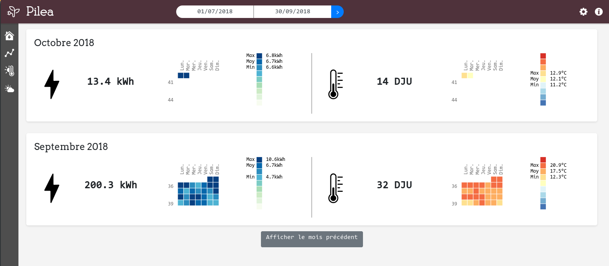
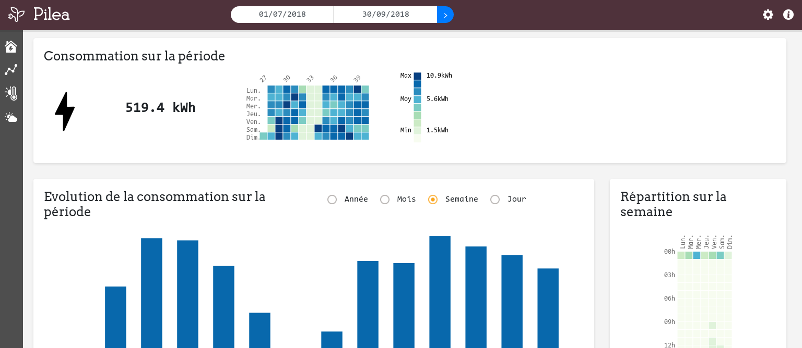

# Pilea - A little dashboard to analyse your electricity consumption data from Linky

### *Mostly usable*

The idea of Pilea is to display electricity consumption and weather data on a little dashboard that allow the user to:

* Better understand his electricity consumption,
* Analyse his electricity consumption throw weather data (in a first time, essentialy temperature).

### Interface

A dashboard with several tabs :

* Current consumption state
* General consumption graphics
* Meteo (T°) and energy consumption (work in progress)
* Meteo (T°, Nebulosity, Rain)

### Data

Data are daily collected, we get:

* Electricity consumption data from your Linky via Enedis API (inspired by [php-LnkyAPI](https://github.com/KiboOst/php-LinkyAPI))
* Weather observation data from [Meteo France Synop data](https://donneespubliques.meteofrance.fr/?fond=produit&id_produit=90&id_rubrique=32)

### Install

* Get the repo
* Copy app/config/parameters.yml.dist to app/config/parameters.yml
* Set Database name and password in parameters.yml
* Run install script: `bin/console pilea:install [user]`
  (where *[user]* is the user who will run the cron)
