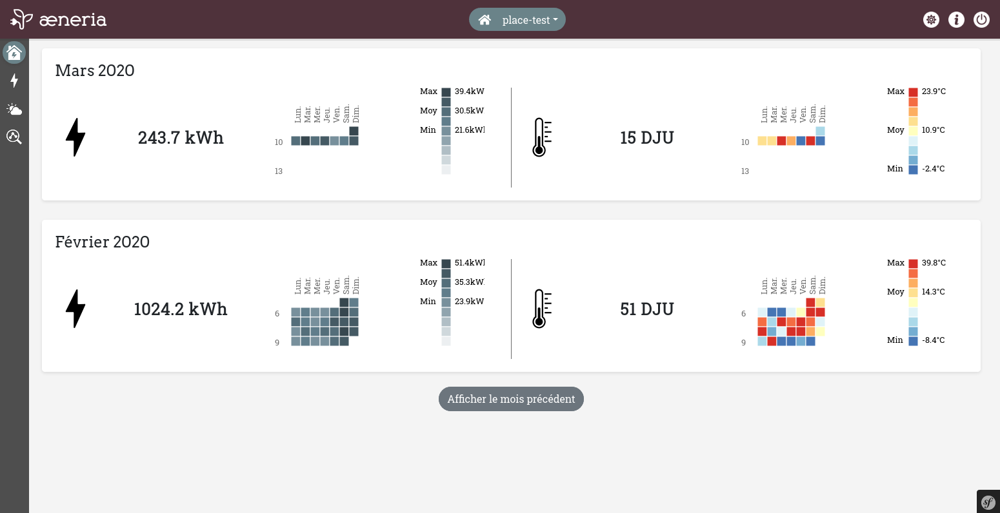

æneria
########

.. image:: img/favicon.png
   :align: center

`æneria <https://gitlab.com/aeneria/aeneria-app/>`_ est un petit tableau de bord permettant d'analyser sa
consommation d'électricité à partir des données d'un Linky.

L'idée derrière æneria est de permettre à l'utilsateur de pouvoir, au travers de quelques tableaux de bord :

* Mieux comprendre sa consommation d'énergie
* Analyser sa consommation en fonction de données météorologiques

.. note::

   **Cette application n'est pas une tentative pour prouver que les compteurs Linky sont cools.**
   Je ne suis pas fan des compteurs Linky et vous pourrez comprendre pourquoi en lisant `ce dossier
   du site Reporterre <https://reporterre.net/Linky-n-est-pas-un-ami-la-grande-enquete-de-Reporterre>`_.

   Maintenant, Linky est présent chez nous alors autant l'utiliser !

   Et malgré ce qu'essaye de nous vendre Enedis:

   "Linky c'est génial, les utilisateurs pourront reprendre en main leurs données et réduire leur consommation... blablabla.."

   Rien n'est apparement fait pour aider les particuliers à récupérer leur données de manière automatique via une API (ou alors
   je n'ai pas réussi à trouver la documentation). Rien n'est fournit pour récupérer facilement ses données.

   J'en porfite pour remercier KibOost pour `le travail de rétroengineering <https://github.com/KiboOst/php-LinkyAPI>`_ dont je me suis pas mal inspiré !

.. toctree::
   :maxdepth: 2
   :caption: Contenu :

   install
   utilisateur
   administrateur
   developpeur

Todo List
=========

 * Ajouter un onglet pour comparer des périodes et/ou des adresses
 * Pouvoir importer des données

Support
=======

Posez vos questions sur `Gitlab <https://gitlab.com/aeneria/aeneria-app/issues/>`_.
