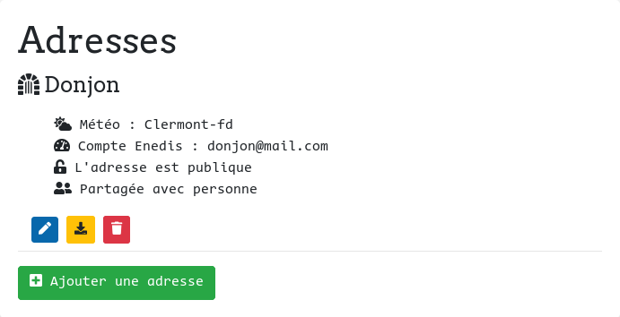
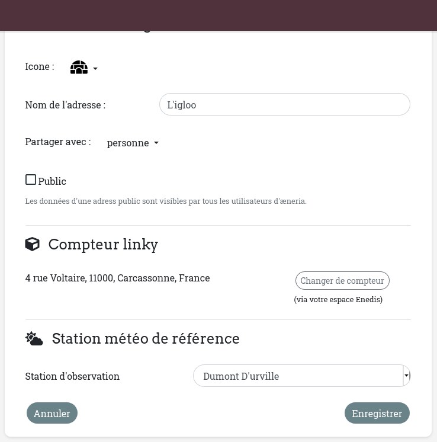

Gestion des adresses
##########################

Dans Pilea, chaque utilisateur peux gérer des *Adresses*. Pour chaque *adresse*,
on configure un compteur Linky et une station d'observation météo.

Une *adresse* peut ensuite être rendue publique pour quelle soit visible par tous les
utilisateurs de Pilea, ou bien, elle peut être partagée à une liste d'utilisateur.

Pour gérer vos adresses, aller sur la page de configuration sur le bouton |icon_configuration|
dans la barre du haut.

Cliquer ensuite sur le bouton ``Ajouter une adresse`` sous la liste des adresses existantes :

Ci-dessous, le formulaire d'ajout d'une adresse :

