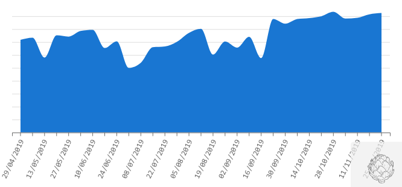
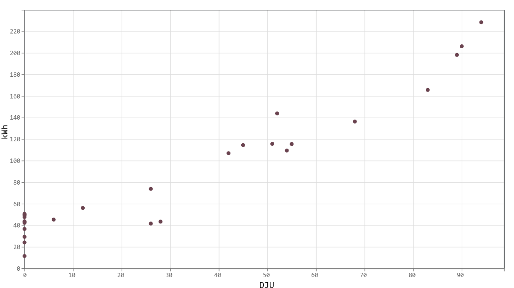

Comprendre les différents graphiques
########################################

Cette page rescence les différents types de graphique présents dans æneria et apporte
quelques éléments pour commencer à les analyser.

Graphique d'évolution temporelle
================================

Le graphique d'évolution temporelle est un graphique assez classique.

Il affiche, pour la période sélectionnée, un point de donnée en fonction de la granulosité choisie.

Il présente chaque point de donnée de donnée sous forme de rectangle, il se transofrme en courbe si le nombre
de données à afficher est trop élevé.

Aperçus
---------

.. image:: ../img/graph_evo_temp_1.png
    :align: center
    :alt: Aperçu du Graphique d'évolution temporelle

Comment lire le graphique
--------------------------

Ce graphique permet par exemple de relever des consommations anormales :

J'observe ma consommation d'électricité, pour un jour donnée je vois un pic sur le graphique, est-ce normal ? Que s'est-il passé ce jour ?

  * Etait-ce un retour de vacances ? Dans ce cas le pic est peut-être normal (reprise de chauffage par exemple)
  * Ou bien ai-je oublié d'éteindre un appareil gourmand avant d'aller me coucher ce jour-là ?

Carte de chaleur Jours/Heures
===============================

Chaque case de la carte de chaleur Jours/Heures affiche la moyenne, sur la période sélectionnée, de la grandeur observée pour une tranche horaire.

Par exemple, la case en haut à gauche représente la consommation moyenne le lundi entre minuit et 1h sur la période sélectionnée.

Plus une case en foncée et plus la consommation est élévée.

Aperçus
--------

.. image:: ../img/graph_jours_heures.png
    :align: center
    :alt: Aperçu de la Carte de chaleur Jours/Heures

Comment lire le graphique
--------------------------

Ce graphique permet de mettre en valuer des schémas de consommation. Les tâches observées doivent reflêter vos habitudes de consommation.

* Une tâche foncée apparait les jours de semaine entre 7h30 et 9h, est-ce normal ?
* Je ne vois aucun schéma se dégager, est-ce normal que ma consommation soit la même quelque soit l'heure et le jour de la semaine ?
* Il y a une tâche continue toute la journée du jeudi, mais pas les autres jours, n'y aurait-il pas un problème dans la programmation de mon chauffage ?

Carte de chaleur Jours/Semaines
================================

Sur ce graphique, chaque case représente un jour, chaque ligne une semain et chaque colonne un jour de la semaine. Plus la case est foncée est plus
la grandeur observée est grande.

Aperçus
--------

.. image:: ../img/graph_jours_semaines.png
    :align: center
    :alt: Aperçu de la Carte de chaleur Jours/Semaines

Comment lire le graphique
--------------------------

Comme la carte de chaleur Jours/Heures, ce graphique permet de mettre en évidence des schémas de consomation. Par exemple : En hiver,
j'observe que les 2 dernières colonnes sont plus foncée, c'est peut-être normal si l'on chauffe toute la journée le weekend
contrairement aux jours de semaine.

Ensuite, comme le graphique d'évolution, il permet de repérer des pics de consommation : pourquoi cette case est-elle foncée au milieu de l'été ?
Que s'est-il passé ce jour là ?

Cette représentation permet aussi d'observer des évenements tels que les vacances : je suis parti une semaine en février, pourtant, je ne le vois pas sur le graphique ?
Ai-je éteint le chauffage avant de partir ?

Afficher sur une ou plusieurs années, il permet aussi de voir apparaite des saisonalités (notamment sur le tableau de bords météo)

Graphique d'analyse croisée
================================

L'analyse croisée permet de chercher des corrélations entre 2 grandeurs. Pour la période sélectionnée, il affiche un point selon la granulosité choisit.

Aperçus
---------

Comment lire le graphique
--------------------------

Si on prend le cas où l'on observe la consommation d'électricité et les :term:`DJU`s et si l'on considère que le chauffage est électrique.
Si l'on sélectionne une péridoe d'hiver, les points affichés devraient se regrouper le long d'une ligne.

L'analyse de la pente de cette droite permet de caractériser l'isolation et le système de chauffage de votre habitation.
Par exemple, si la droite semble horizontale, cela veut peut-être dire que votre chauffage est toujours au maximum et donc qu'il est sous
dimensionné.

Si les points semblent complètement désorganisés, c'est qu'il n'y a aucune corrélation entre la température extérieure et votre consommation
d'électrivité.

Graphique papillon
============================

La graphique papillon est un graohique d'évolution temporelle, à la vertical, sur lequel on affiche simultanément l'évolution de 2 grandeurs
dans le temps.

Aperçus
----------

.. image:: ../img/graph_papillon.png
    :align: center
    :alt: Aperçu du Graphique papillon

Comment lire le graphique
---------------------------

Comme le graphique d'analyse croisée, le graphique papillon permet de chercher des corrélations entre 2 grandeurs. Dans le cas de æneria, on
compare toujours la consommation d'électicité et une grandeur météorologique.

Si 2 grandeurs sont directement corrélées, le graphique devrait ressembler à un papillon, c'est à dire être symétrique, d'où sont nom.
